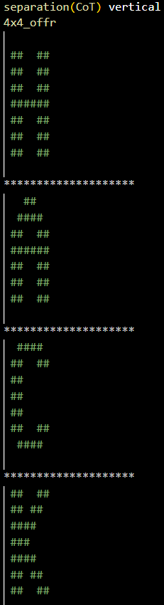

## Appendix B.  Example of ASCII Art Text in Horizontal and Vertical Arrangements

![figB1][./fig/figB1.png)

**Fig. B1. Example of ASCII Art Text in Horizontal Arrangement.**

 

**Fig. B2. Example of ASCII Art Text in Vertical Arrangement.**

**Fig. B3. Example of ASCII Art Text in Horizontal Arrangement with separation (i.e., CoT).**

**Fig. B4. Example of ASCII Art Text in Vertical Arrangement  with separation (i.e., CoT).**
