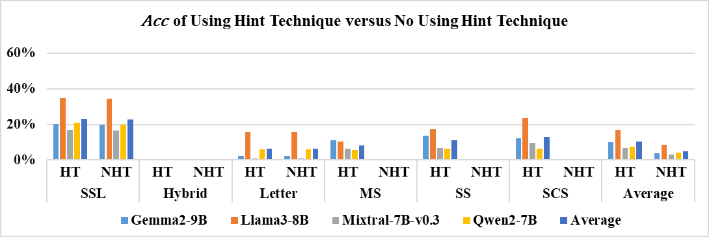
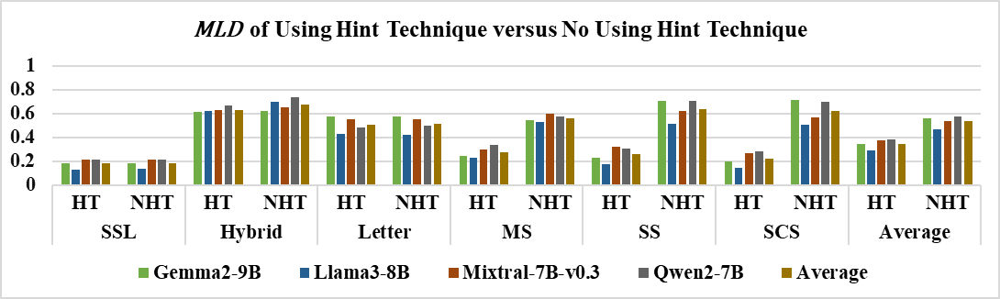

## Appendix D.   Font with Hint (Vertical Arrangement Art)

**Fig. D1. Accuracy comparison between the Hint Technique (HT) and No Hint Technique (NHT) in a vertical arrangement. HT represents the use of the Hint technique, while NHT represents the absence of the Hint technique.**

 

**Fig. D2.** **Comparison of**  **between the Hint Technique (HT) and No Hint Technique (NHT) in a vertical arrangement. (HT: Hint Technique; NHT: No Hint Technique.)**
