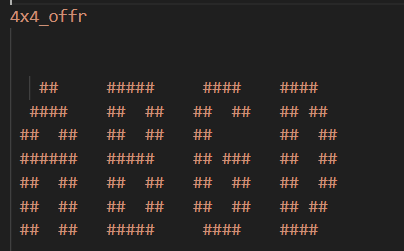
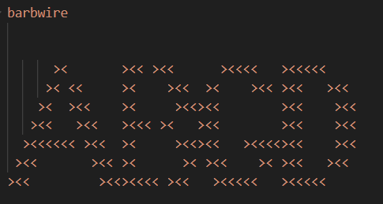
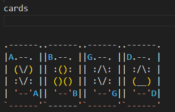
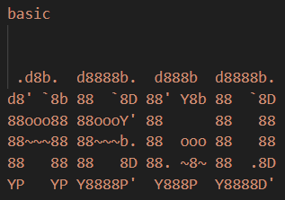
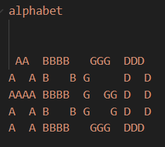
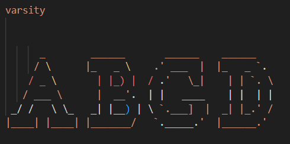

## Appendix A.  Example of Font Vision Representation

**Fig. A1. Example of SS category in text ABGD.**

**Fig. A2. Example of SCS category in text ABGD.**

 

**Fig. A3. Example of SSL category in text ABGD.**

 

**Fig. A4. Example of Hybrid category in text ABGD.**

**Fig. A5. Example of Letter category in text ABGD.**

**Fig. A6. Example of MS category in text ABGD.**
